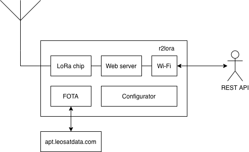

# About

Expose LoRa modules for remote access

# Design



r2lora exposes LoRa module functionality via REST API. This API can be accessed from any other device in the same network.

# Features

 * REST API
   * RX start/stop
   * TX
   * Device status
 * Basic authentication
 * Initial configuration via standalone WiFi access point
 * [FOTA](https://dernasherbrezon.com/posts/fota-for-r2lora/) updates from [apt.r2server.ru](https://apt.r2server.ru)

# Supported boards

 * [ttgo-lora32-v2](https://docs.platformio.org/en/latest/boards/espressif32/ttgo-lora32-v2.html)
 * [ttgo-lora32-v1](https://docs.platformio.org/en/latest/boards/espressif32/ttgo-lora32-v1.html)
 * [ttgo-lora32-v21](https://docs.platformio.org/en/latest/boards/espressif32/ttgo-lora32-v21.html)
 * [heltec_wifi_lora_32](https://docs.platformio.org/en/latest/boards/espressif32/heltec_wifi_lora_32.html)
 * [heltec_wifi_lora_32_V2](https://docs.platformio.org/en/latest/boards/espressif32/heltec_wifi_lora_32_V2.html)
 * [ttgo-t-beam](https://docs.platformio.org/en/latest/boards/espressif32/ttgo-t-beam.html)

# How to install / compile

1. Install [PlatformIO](https://platformio.org) GUI or CLI version

2. Clone this repository:

```bash
git clone https://github.com/dernasherbrezon/r2lora.git
```

3. Build the application. Replace ```board``` with one of board names above.

```bash
cd r2lora
pio run -t upload -e board
```

# How to configure

After initial installation, r2lora will start WiFi access point "r2lora".

 * Connect to "r2lora" WiFi
 * Open http://192.168.4.1 address
 * Make required changes to the configuration and save
 * **IMPORTANT** disconnect from "r2lora" WiFi

If everything is ok, then r2lora will attempt to connect to your local WiFi. If connection is successful, then it will print IP address within your local network. You can open it to amend configuration.
